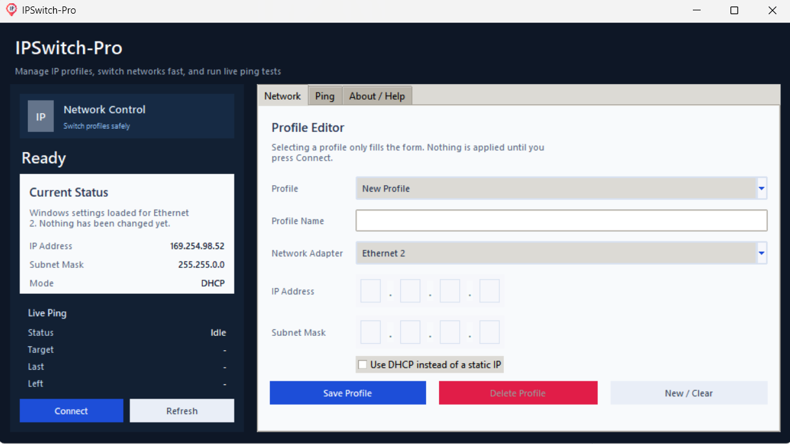

# 🚀 IPSwitch Ping Pro

**IPSwitch Ping Pro** is a powerful Windows tool designed to help you **manage network IP profiles**, **quickly switch between configurations**, and **run real-time ping tests** — all in one lightweight application.

---

## 🔥 Features

- ⚡ **Fast IP Switching**
  - Instantly switch between multiple saved IP profiles
  - Supports Static IP and DHCP modes

- 📡 **Live Ping Monitoring**
  - Test connectivity to any IP or host
  - Real-time network status feedback

- 💾 **Profile Management**
  - Save, edit, and reuse network configurations
  - Ideal for engineers working with multiple devices

- 🧠 **Smart Network Handling**
  - Automatically apply network settings
  - Quickly revert back to DHCP

- 🛠 **User-Friendly Interface**
  - Clean and minimal UI
  - Designed for speed and simplicity

---

## 🎯 Use Cases

- Industrial Automation Engineers (Siemens PLC, SCADA, etc.)
- IT Professionals managing multiple networks
- Developers working with local servers or embedded systems
- Anyone who frequently switches between network configurations

---

## 🖥️ Screenshots

> Add more screenshots here if needed

---

## 🚀 Getting Started

1. Download the latest release
2. Run the application
3. Create your IP profiles
4. Switch networks with one click
5. Use built-in ping tool to test connectivity

---

## 🔑 Keywords (SEO)

IP Switch Tool, Network Profile Manager, IP Configuration Tool, DHCP Switcher, Static IP Tool, Ping Tool Windows, Network Utility, IP Manager Software

---

## 💡 Why IPSwitch Ping Pro?

Unlike traditional network tools, IPSwitch Ping Pro combines **IP configuration management** and **network testing** in one simple interface — saving you time and eliminating manual configuration errors.

---

## 📌 Requirements

- Windows 10 / 11
- Administrator privileges (for network changes)

---

## 🧑‍💻 Author

Developed with ❤️ by POWEREN

---

## 📄 License

MIT License